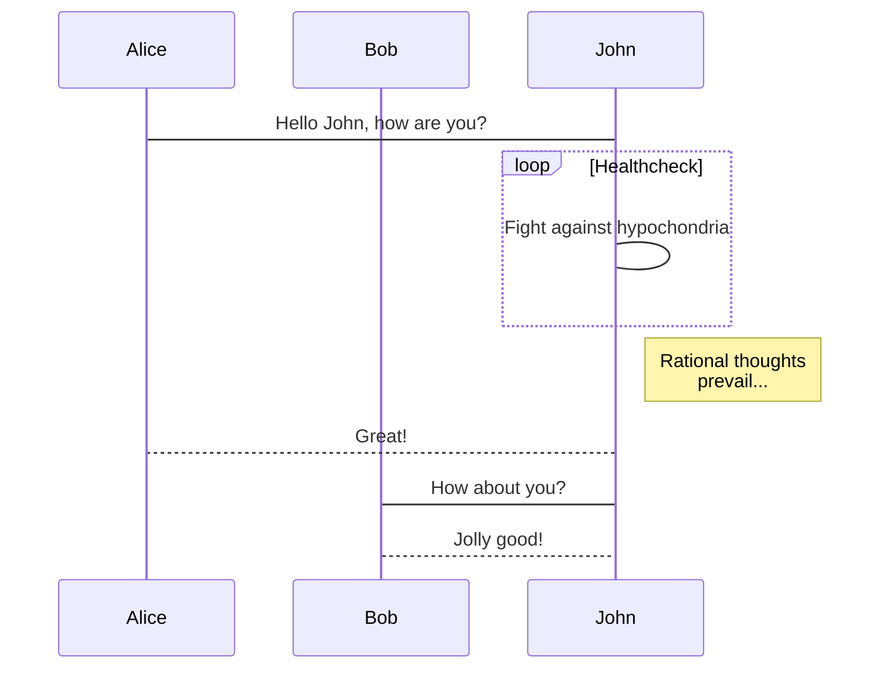

+++
title = '文章1'
date = 2024-03-05T16:41:08+08:00
draft = false
+++

# 歡迎使用 MWeb
MWeb 是一款功能很全面的 Markdown 編輯，筆記和發佈軟件。目前已支持 macOS/iPadOS/iOS 三個平台，並針對每個平台做了深度優化，macOS 版的 MWeb Pro 還有靜態網站生成功能。所以，MWeb 算是比較複雜的軟件了。因此，開始使用 MWeb 前，建議先閱讀使用文檔。請點首頁的 「如何使用 MWeb？」 來閱讀使用文檔。

## 幫助我們改進 MWeb

如果你喜歡 MWeb，想讓它變得更好，你可以：

1. 推薦 MWeb，讓更多的人知道。
2. 給我們發反饋和建議：<coderforart+2333@gmail.com>
3. 在 App Store 上評價。

